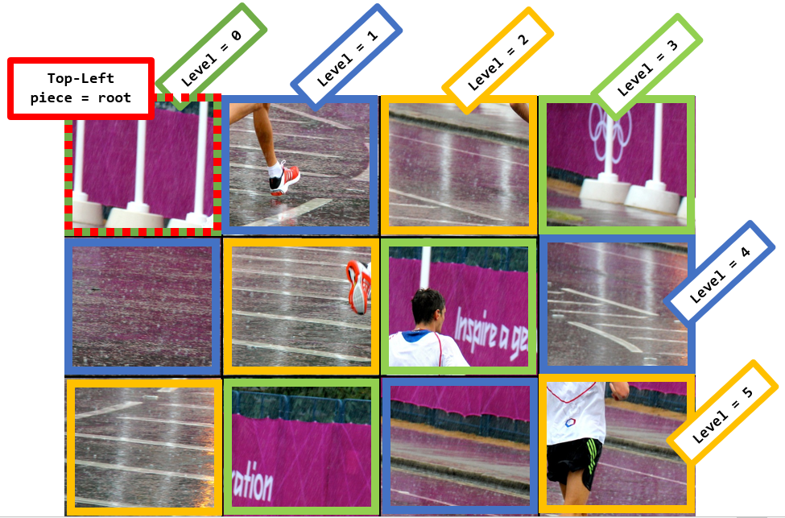
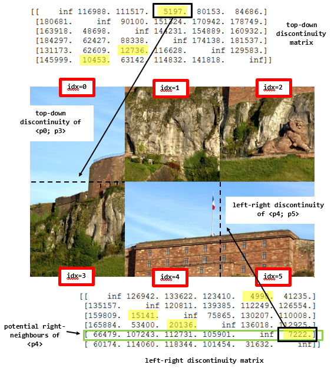
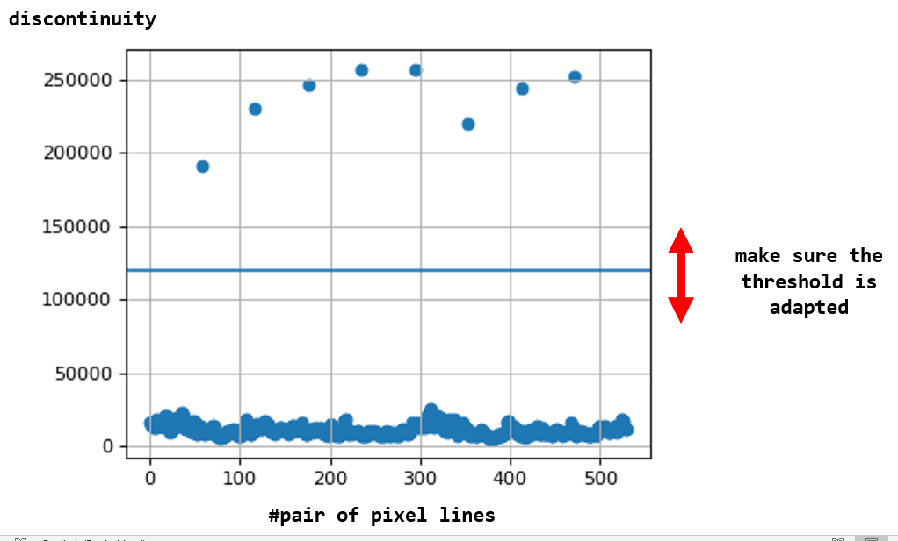

# image_puzzle_solving

|   | 
|:--:| 
| *examples of puzzle solving* |

## Assumptions
- constant width of columns (two neighbours may be already next to each other)
- constant height of rows (two neighbours may be already next to each other)
- .png colour pictures as input

## Tools
- a **"fitness"** is defined for a pair of pieces
    - it represents the sum of **discontinuity** in the three colour channels when crossing the border
- a **level** represents a group of pieces equally distant to the top-left corner

|   | 
|:--:| 
| *conventions for 'levels'* |

## Problem Setting
- determine the **number of rows** and **number of columns**
    - measures of discontinuity between two consecutive lines of pixels are collected
    - a threshold is applied. It must be hand-tuned *(see plot below)*
    - given the `constant width` and `constant height` assumption, a **Greatest Common Divisor** method is used to infer the most plausible number of rows and columns
- decompose the picture in pieces based on the inferred dimensions
- compute **two fitness matrices**
    - they give for each pair of pieces the discontinuity
    - for the `left->right` and the `top->down` transitions
- model the problem using a **Graph**
    - Let **each piece** be a **node** in a graph
	- Let each pair of pieces be connected by **four directed vertices**:
        - Two representing the horizontal discontinuity (`p1->p2` and `p2->p1`) and two for the vertical discontinuity (`p1->p2` and `p2->p1`)
        - the **graph is complete**, hence the existence of a **Hamiltonian Path** is ensured
    - The problem now boils down to **finding a path** that
        - **visits exactly once** each piece of the puzzle
        - while having the **lowest total cost** (sum of discontinuity measures at each transition)
        - while respecting the **shape of the image**: `n_rows * n_cols`

## Problem Solving

Instead of a **global optimization**, a **greedy approach** is followed here:

- find the best **root piece** for the **top-left corner**
	- it is the worse element in term of `right-neighbouring` and `down-neighbouring`
- iterate per "level":
	- for each position in the new level, find the **two parents** (upper and left neighbours) in the previous level
	- among all the available pieces, choose the one that **fits the best**: i.e. with the lowest sum of horizontal and vertical discontinuity to the parents

|   | 
|:--:| 
| *naming conventions for fitness matrix* |

|   | 
|:--:| 
| *threshold tuning to get n_cols and n_rows* |

### Getting Started

- to install Pillow:
	- `> pip install Pillow`

- if you already have a shuffled image you want to solve: place it at the root of the repo and name it `shuffled.png`
	- else: choose the cuts you want to apply before randomly shuffling `original.png`
		- `n_cols_wanted = 2`
		- `n_rows_wanted = 3`
- run [`image_puzzle_solving.ipynb`](https://github.com/chauvinSimon/image_puzzle_solving/blob/master/image_puzzle_solving.ipynb)

### Acknowledgement

triathlon pictures by [ITU](https://www.triathlon.org/)